# دیابت ملیتوس: فیزیوپاتولوژی، طبقه‌بندی، تشخیص، درمان و عوارض حاد و مزمن

## ۱. کلیات، تعاریف و اپیدمیولوژی

> [!definition] دیابت ملیتوس (Diabetes Mellitus)
> 
> سندرم متابولیک مزمن ناشی از اختلال مطلق یا نسبی در **ترشح انسولین**، **عملکرد انسولین** یا هر دو. تظاهر بیوشیمیایی نهایی و مشترک تمامی انواع آن **هایپرگلیسمی مزمن** است که با اختلال همزمان در متابولیسم _کربوهیدرات_، _لیپید_ و _پروتئین_ همراه است. شایع‌ترین اختلال سیستم درون‌ریز (Endocrine) در انسان محسوب می‌شود.

### اپیدمیولوژی جهانی و منطقه‌ای (IDF Atlas 2024)

- **شیوع جهانی:** حدود **589 میلیون نفر** از جمعیت بالای 20 سال جهان مبتلا به دیابت هستند (معادل **1 نفر از هر 9 نفر**).
    
- **مرگ‌ومیر:** وقوع یک مورد مرگ ناشی از دیابت در هر **6 ثانیه** در سطح جهان.
    
- **بار مالی سلامت:** اختصاص بیش از **1 تریلیون دلار** از بودجه‌های بهداشت جهانی به دیابت و عوارض آن.
    
- **وضعیت در خاورمیانه و شمال آفریقا (MENA):** بالاترین شیوع منطقه‌ای در سطح جهان؛ آمار مبتلایان در ایران به **حدود 7 میلیون نفر** (پیش از پاندمی کرونا) می‌رسد که حدود **150 هزار نفر** از آنان مبتلا به **دیابت نوع 1** هستند.
    

## ۲. طبقه‌بندی اتیوپاتولوژیک دیابت ملیتوس

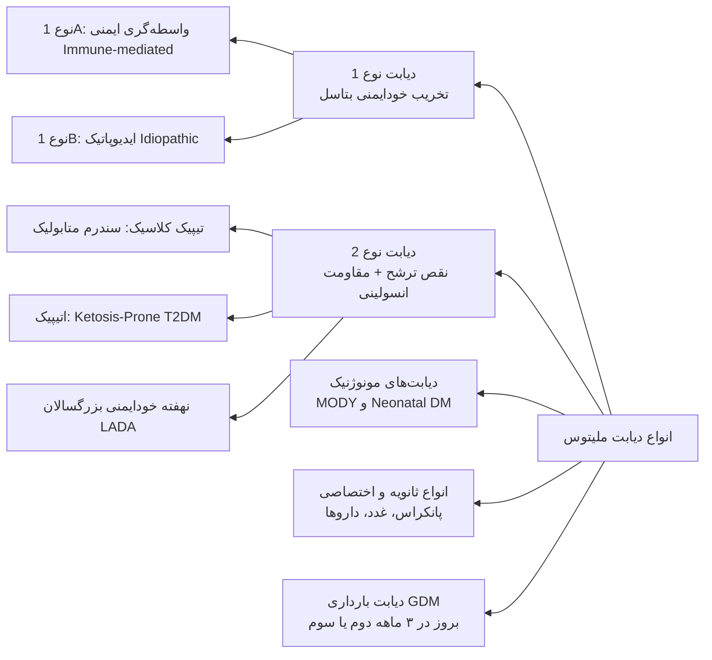

### مقایسه جامع دیابت نوع 1 و نوع 2

| **شاخص بالینی و بیولوژیک**        | **دیابت نوع 1 (Type 1 DM)**                                  | **دیابت نوع 2 (Type 2 DM)**                                       |
| --------------------------------- | ------------------------------------------------------------ | ----------------------------------------------------------------- |
| **سیر معمول بالینی**              | وابسته به انسولین اگزوژن از بدو تشخیص                        | در ابتدا مستقل از انسولین؛ کنترل با داروهای غیرانسولینی           |
| **سن شایع بروز**                  | عمدتاً زیر 20 سال (**40% بالای 30 سال**)                     | عمدتاً بالای 40 سال (روند رو به کاهش و شیوع در اطفال)             |
| **وضعیت شاخص توده بدنی (BMI)**    | معمولاً لاغر یا وزن نرمال (بیماران نوساز ممکن است چاق باشند) | عمدتاً چاق یا دارای اضافه‌وزن (**بیش از 80%**)؛ همراه چاقی احشایی |
| **نحوه شروع علائم**               | حاد، پر سر و صدا و دراماتیک (چند روز تا چند هفته)            | موذیانه، تدریجی، بی‌علامت و مخفی (چند ماه تا سال‌ها)              |
| **تمایل به کتوز (Ketosis-prone)** | بله، بسیار مستعد کتواسیدوز دیابتی (DKA)                      | معمولاً مقاوم به کتوز (به جز فرم _Ketosis-Prone T2DM_)            |
| **سابقه خانوادگی**                | کمتر از 15% در بستگان درجه اول                               | بسیار شایع و قوی‌تر از نوع 1 (**کونکوردانس دوقلوها 70-90%**)      |
| **ارتباط با آنتی‌ژن‌های HLA**     | همراهی قوی با **HLA-DR3**, **HLA-DR4**, **DQB1*0302**        | عدم وجود ارتباط با سیستم HLA                                      |
| **اتوآنتی‌بادی‌های ضد جزایر**     | مثبت در بیش از 85-90% بیماران (GAD, ICA, IA-2, ZnT8)         | منفی یا بسیار نادر                                                |
| **سطح پپتید C و انسولین سرم**     | بسیار پایین تا غیرقابل سنجش (کمبود مطلق)                     | متغیر: نرمال، بالا یا اندکی کاهش‌یافته (کمبود نسبی)               |

> [!important] تغییر پارادایم سن در تشخیص **سن بروز** دیگر معیار قطعی تفکیک نوع 1 از نوع 2 نیست! امروزه **بیش از 40%** مبتلایان به دیابت نوع 1 پس از سن **30 سالگی** تشخیص داده می‌شوند، و همزمان شیوع دیابت نوع 2 در کودکان و نوجوانان به دلیل اپیدمی چاقی رو به فزونی است.

## ۳. دیابت‌های مونوژنیک و انواع اختصاصی (Specific Types)

### الف) دیابت‌های مونوژنیک (Monogenic Diabetes)

شامل **حدود 5%** کل موارد دیابت. معمولاً با شروع هایپرگلیسمی خفیف تا متوسط (150-160 mg/dL) در سنین **زیر 25 سال**، فنوتیپ غیر چاق، تست اتوآنتی‌بادی **منفی** و سطح سرمی **C-peptide مثبت** تظاهر می‌یابند. نحوه توارث اغلب **اتوزومال غالب (AD)** است.

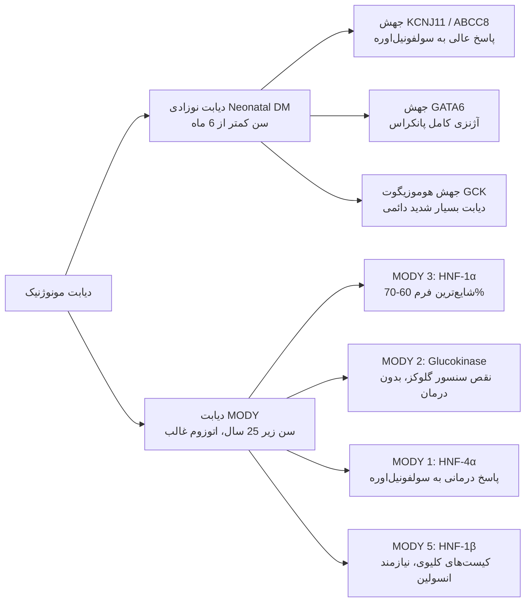

### طیف ژنتیکی دیابت MODY

| **نوع MODY** | **ژن درگیر**   | **عملکرد پروتئین و پیامد پاتولوژیک**                     | **ویژگی‌های بالینی و رویکرد درمانی اختصاصی**                                                 |
| ------------ | -------------- | -------------------------------------------------------- | -------------------------------------------------------------------------------------------- |
| **MODY 1**   | _HNF4A_        | فاکتور رونویسی هپاتوسیت و سلول بتای پانکراس              | بروز نارسایی تدریجی بتاسل؛ **پاسخ درمانی عالی به سولفونیل‌اوره**                             |
| **MODY 2**   | _GCK_          | گلوکوکیناز (سنسور گلوکز سلول بتا و کبد)؛ افزایش ست‌پوینت | هایپرگلیسمی خفیف و بدون تغییر؛ **عدم نیاز به درمان دارویی (بجز بارداری)**                    |
| **MODY 3**   | _HNF1A_        | فاکتور رونویسی هسته‌ای هپاتوسیت؛ تنظیم ترشح انسولین      | **شایع‌ترین نوع MODY**؛ حساسیت شدید به **سولفونیل‌اوره**؛ قطع انسولین قبلی                   |
| **MODY 4**   | _IPF-1 (PDX1)_ | هومئوباکس پانکراسی-دئودنومی؛ تکامل و رونویسی انسولین     | اختلالات تکاملی پانکراس و سنتز هورمون انسولین                                                |
| **MODY 5**   | _HNF1B_        | فاکتور رونویسی اندودرم احشایی و بافت مزانشیم             | **کیست‌های کلیوی**، آتروفی اگزوکرین پانکراس، آنزیم‌های غیرعادی کبد؛ **نیاز قطعی به انسولین** |
| **MODY 6**   | _NEUROD1_      | تمایز سلول‌های عصبی و غدد درون‌ریز لانگرهانس             | فرم‌های نادر دیابت مونوژنیک همراه با اختلالات پیشرونده ترشحی                                 |

> [!tip] ترتیب شیوع امتحانی MODY
> توالی شیوع فرم‌های شایع: **MODY 3 > MODY 2 > MODY 1**.
> دیابت مونوژنیک اولین الگوی **پزشکی شخصی‌سازی شده (Personalized Medicine)** در دیابت است، زیرا تشخیص زودهنگام منجر به درمان با قرص ارزان‌قیمت سولفونیل‌اوره و قطع تزریق انسولین در MODY 1 & 3 می‌شود.

### ب) دیابت نوزادی (Neonatal Diabetes Mellitus - NDM)

- **تعریف زمانی:** بروز هایپرگلیسمی نیازمند درمان در **6 ماهه اول زندگی** (دیابت نوع 1 خودایمنی در زیر 6 ماهگی تقریباً ناممکن است).
    
- **جهش کانال‌های پتاسیمی:** جهش فعال‌کننده در ژن‌های _KCNJ11_ (کدکننده Kir6.2) و _ABCC8_ (کدکننده SUR1)؛ کانال K-ATP باز می‌ماند و مانع دپلاریزاسیون می‌شود. **درمان انتخابی: سولفونیل‌اوره خوراکی با دوز بالا (عدم نیاز به انسولین)**.
    
- **آژنزی پانکراس:** جهش در فاکتور رونویسی **GATA6** شایع‌ترین علت نقص ساختاری پانکراس است.
    
- **جهش میتوکندریایی:** همراهی دیابت با **ناشنوایی عصبی-حسی (Sensorineural Hearing Loss)** به دلیل جهش‌های DNA میتوکندری (tRNA Leu).
    

### ج) اختلالات عملکرد گیرنده انسولین (مقاومت شدید تک‌ژنی)

1. **Type A Insulin Resistance:** زنان جوان، هایپرانسولینمی شدید، چاقی و علائم هایپرآندروژنیسم.
    
2. **Rabson-Mendenhall Syndrome:** جهش در ژن گیرنده انسولین، هایپرپلازی پینه‌آل، اختلالات دندانی، دیسپلازی ناخن.
    
3. **Leprechaunism (Donohue Syndrome):** اختلال مرگبار داخل رحمی، دیس‌مورفیسم صورتی، لاغری مفرط و فقدان چربی زیرپوستی.
    
4. **Lipoatrophic Diabetes:** فقدان موضعی یا عمومی بافت چربی، هایپرتری‌گلیسریدمی شدید و مقاومت خشن به انسولین.
    

### د) بیماری‌های اگزوکرین پانکراس (دیابت پانکراتیک یا نوع 3c)

- تخریب بیش از **80% بافت پانکراس** برای بروز هایپرگلیسمی بالینی الزامی است.
    
- **پاتوفیزیولوژی:** به دلیل تخریب همزمان بتاسل‌ها و آلفاسل‌ها، بیمار با **فقدان همزمان انسولین و گلوکاگون** مواجه است (نوسانات شدید قند خون و خطر بالای افت قند).
    
- **دیابت وابسته به سیستیک فیبروزیس (CFRD):** در 20% نوجوانان و **50% بزرگسالان** مبتلا به CF دیده می‌شود. علت: _Insulin Insufficiency_. **روش غربالگری:** سالانه با تست **OGTT** از سن بالای 10 سال (**HbA1c در CF فاقد ارزش تشخیصی است!**). درمان: منحصراً **انسولین**.
    
- **غربالگری پانکراتیت:** پس از یک حمله پانکراتیت حاد، ارزیابی بیمار در ماه **3 الی 6** و سپس سالانه الزامی است. در پانکراتیت مزمن، غربالگری **سالانه** انجام می‌گیرد.
    
- **دیابت پس از پیوند عضو (PTDM):** به دنبال مصرف داروهای دیابتوژنیک نظیر مهارکننده‌های کلسینورین (تاکرولیموس، سیکلوسپورین)، مهارکننده‌های mTOR و کورتیکواستروئیدها. در **90% گیرندگان پیوند کلیه** رخ می‌دهد. تست تشخیصی استاندارد: **OGTT** پس از استیبل شدن بیمار. _نکته امتحانی: داروهای ایمونوساپرسیو نباید به دلیل دیابت قطع شوند._
    

### هـ) داروها و سموم شیمیایی دیابتوژنیک

1. سم موش‌کش واکور (Vacor)
    
2. پنتامیدین (Pentamidine - تخریب مستقیم سلول بتا)
    
3. اسید نیکوتینیک (نیاسین)
    
4. گلوکوکورتیکوئیدها (القای مقاومت کبدی و محیطی)
    
5. هورمون تیروئید با دوز بالا
    
6. دیازوکساید و دیورتیک‌های تیازیدی (با دوز بالا)
    
7. آگونیست‌های بتای آدرنرژیک
    
8. فنی‌توئین (Phenytoin - مهار ترشح انسولین)
    
9. اینترفرون آلفا (α-Interferon)
    
10. مهارکننده‌های پروتئاز HIV
    
11. کلوزاپین و آنتی‌سایکوتیک‌های آتیپیک
    
12. استاتین‌ها (افزایش بسیار خفیف مقاومت انسولینی)
    
13. مهارکننده‌های چک‌پوینت ایمنی (ICI): به ویژه آنتی‌بادی‌های ضد **PD-1** یا **PD-L1** (تکی یا ترکیبی با Anti-CTLA4)؛ با تخریب فولمینانت بتاسل و **شروع ناگهانی DKA** در کمتر از 1% بیماران همراه است. درمان قطعی: **انسولین**.
    

## ۴. معیارهای استاندارد غربالگری و تشخیص دیابت و پره‌دیابت

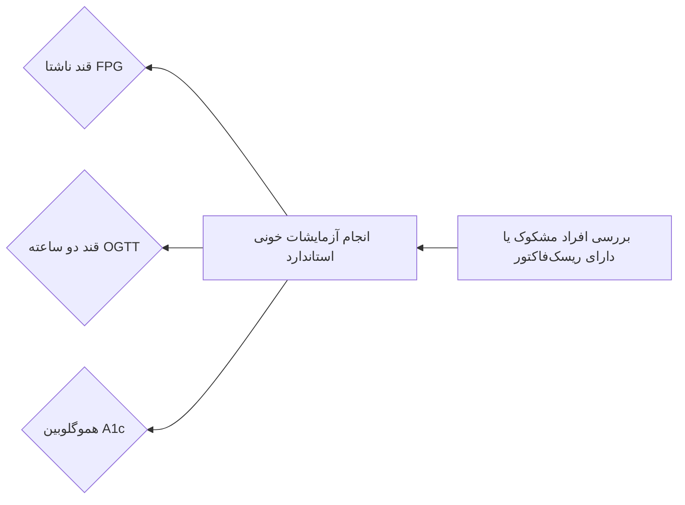

### جدول مقادیر آزمایشگاهی تشخیصی

| **وضعیت بالینی**            | **قند پلاسمای ناشتا (FPG)** | **قند 2 ساعته در تست 75g OGTT** | **هموگلوبین A1c** | **قند پلاسمای تصادفی (Random)**                       |
| --------------------------- | --------------------------- | ------------------------------- | ----------------- | ----------------------------------------------------- |
| **طبیعی (Normal)**          | کمتر از 100 mg/dL           | کمتر از 140 mg/dL               | کمتر از 5.7%      | —                                                     |
| **پیش‌دیابت (Prediabetes)** | 100 تا 125 mg/dL (_IFG_)    | 140 تا 199 mg/dL (_IGT_)        | 5.7% تا 6.4%      | —                                                     |
| **دیابت ملیتوس (Diabetes)** | **126 mg/dL یا بیشتر**      | **200 mg/dL یا بیشتر**          | **6.5% یا بیشتر** | **قند 200 mg/dL یا بیشتر** (به شرط وجود علائم کلاسیک) |

> [!important] قاعده قطعی تکرار آزمایش‌ها
> برای تایید تشخیص دیابت، باید **دو تست غیرطبیعی مختلف** از یک نمونه خون گزارش شود یا یک تست غیرطبیعی در **یک نوبت مجزا** تکرار گردد.
> اگر دو تست متفاوت نتایج متناقض نشان دهند (مثلاً FPG در حد پره‌دیابت ولی A1c در حد دیابت)، تست تشخیصی با نتیجه غیرطبیعی بالاتر (**در اینجا A1c**) باید مجدداً تکرار شود.

### خطاهای تفسیری و عوامل مخدوش‌کننده HbA1c

- **ضریب تغییرات بیوشیمیایی (CV):** کمترین نوسان مربوط به **A1c معادل 3.6%**، سپس FPG معادل 5.7% و بیشترین نوسان مربوط به قند 2 ساعته OGTT معادل **16.6%** است.
    
- **کاهش کاذب A1c (کوتاه شدن طول عمر RBC):** آنمی همولیتیک، اسپلنومگالی، عبور گلبول‌ها از دریچه‌های مکانیکی قلب، ترانسفوزیون خون اخیر، مصرف اریتروپوئیتین، نارسایی مزمن کلیه (همودیالیز)، سه ماهه دوم و سوم بارداری، خونریزی حاد.
    
- **افزایش کاذب A1c (افزایش طول عمر RBC):** **آنمی فقر آهن** (کاهش ترن‌اور اریتروسیت‌ها؛ تجویز آهن می‌تواند A1c را تا **1% کاهش** دهد)، مصرف اتانول، اعتیاد به مشتقات تریاک (Opium)، اسپلنکتومی، هایپربیلیروبینمی شدید.
    
- **خطای درون‌فردی قند:** تفاوت درون‌فردی FPG می‌تواند تا 12.5% باشد. به ازای هر یک ساعت ماندن نمونه خون در دمای اتاق، به دلیل گلیکولیز توسط RBCها، قند خون بین **5 تا 7 درصد کاهش** می‌یابد.
    

### تفاوت‌های مکانیسمی IFG و IGT

1. **اختلال قند ناشتا (IFG):** محل اصلی مقاومت انسولینی در **کبد** است. ترشح فاز اول انسولین (First-phase: دقیقه 0 تا 10 در تست گلوکز وریدی و Early-phase خوراکی) به شدت سرکوب شده است.
    
2. **اختلال تحمل گلوکز (IGT):** محل اصلی مقاومت انسولینی در **عضلات اسکلتی** است. فاز تاخیری ترشح انسولین (Late-phase) دچار نقص است.
    

### اندیکاسیون‌های غربالگری در افراد بدون علامت

1. کلیه افراد با اضافه‌وزن یا چاقی (**BMI ≥ 25 kg/m²** یا در نژاد آسیایی **BMI ≥ 23 kg/m²**) دارای حداقل یک ریسک‌فاکتور:
    
    - سابقه فامیلی درجه یک دیابت
        
    - نژاد پرخطر (آفریقایی-آمریکایی، لاتین، آسیایی)
        
    - سابقه بیماری قلبی-عروقی (CVD)
        
    - هایپرتنشن (**فشار خون ≥ 130/80 mmHg** یا تحت درمان فشار خون)
        
    - دیس‌لیپیدمی (**HDL < 35 mg/dL** یا **TG > 250 mg/dL**)
        
    - سندرم تخمدان پلی‌کیستیک (PCOS)
        
    - عدم فعالیت فیزیکی و کم‌تحرکی
        
    - شواهد مقاومت شدید انسولینی (چاقی شدید، آکانتوزیس نیگریکانس، بیماری استئاتوز کبدی MASLD)
        
2. افراد مبتلا به پیش‌دیابت: **غربالگری سالانه**.
    
3. زنان با سابقه دیابت بارداری (GDM): **غربالگری هر 1 تا 3 سال**.
    
4. سایر افراد جامعه: **شروع غربالگری همگانی از سن 35 سالگی**؛ در صورت نرمال بودن، تکرار آزمایش‌ها **حداقل هر 3 سال یک‌بار**.
    

## ۵. دیابت بارداری (Gestational Diabetes Mellitus - GDM)

> [!definition] دیابت بارداری (GDM)
> هر نوع اختلال در متابولیسم کربوهیدرات که برای **نخستین بار در سه ماهه دوم یا سوم بارداری** آغاز یا شناسایی شود. بانوانی که در **سه ماهه اول بارداری** معیار تشخیصی دیابت را دارند، دیابت آشکار از قبل موجود (Pre-existing/Pregestational DM) تلقی می‌شوند.

### غربالگری و استراتژی‌های تشخیصی GDM

- **ویزیت اول بارداری (پیش از هفته 15):** غربالگری افراد پرخطر بر اساس معیارهای روتین دیابت در جمعیت عادی.
    
- **هفته 24 تا 28 بارداری:** ارزیابی همگانی کلیه بانوان باردار فاقد دیابت قبلی با یکی از دو روش:
    

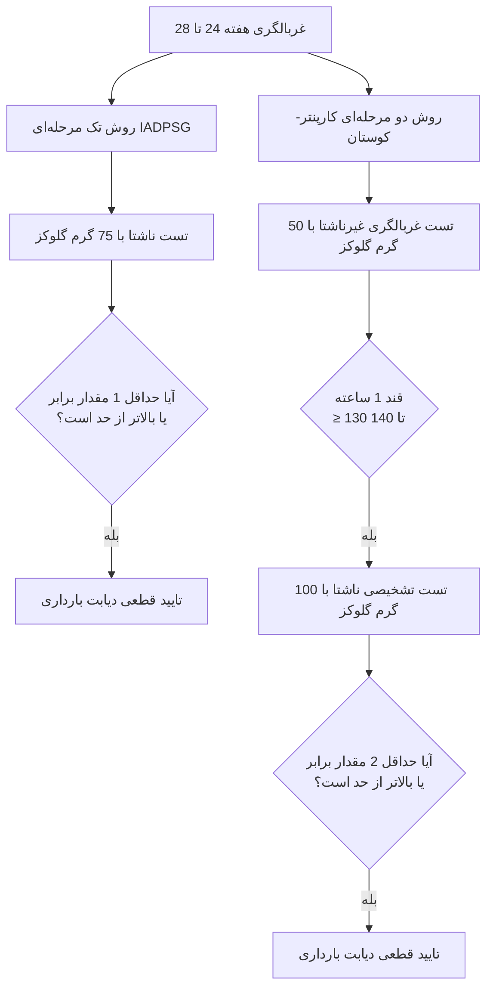

### معیارهای مقایسه‌ای تست تک‌مرحله‌ای و دومرحله‌ای

| **استراتژی تشخیصی**                         | **بار قند**  | **زمان سنجش و آستانه‌های تشخیصی (mg/dL)**                                                                            | **شرط مثبت شدن**           |
| ------------------------------------------- | ------------ | -------------------------------------------------------------------------------------------------------------------- | -------------------------- |
| **تک‌مرحله‌ای (IADPSG)**                    | 75g خوراکی   | • ناشتا: **≥ 92 mg/dL** • یک ساعته: **≥ 180 mg/dL** • دو ساعته: **≥ 153 mg/dL**                                | **حداقل 1 مقدار غیرطبیعی** |
| **دومرحله‌ای: مرحله 1**                     | 50g غیرناشتا | • یک ساعته: **≥ 130 یا 135 یا 140 mg/dL**                                                                            | ارجاع به مرحله دوم         |
| **دومرحله‌ای: مرحله 2 (Carpenter-Coustan)** | 100g ناشتا   | • ناشتا: **≥ 95 mg/dL** • یک ساعته: **≥ 180 mg/dL** • دو ساعته: **≥ 155 mg/dL** • سه ساعته: **≥ 140 mg/dL** | **حداقل 2 مقدار غیرطبیعی** |

> [!tip] چالش روش تک‌مرحله‌ای
> روش تک‌مرحله‌ای به دلیل نیاز به مثبت شدن تنها **یک معیار**، شیوع GDM را به میزان 5 تا 20 درصد افزایش می‌دهد که منجر به **پزشکی‌شدن (Medicalization)** بیش از حد روند بارداری و مراجعات متعدد می‌گردد.
> **پیگیری پس از زایمان:** انجام تست قند **1 تا 3 ماه پس از زایمان** ضروری است؛ زیرا 30 تا 60 درصد مادران مبتلا به GDM در طول زندگی به دیابت نوع 2 مبتلا می‌شوند.

## ۶. پاتوفیزیولوژی سلولی و مولکولی ترشح و اثر انسولین

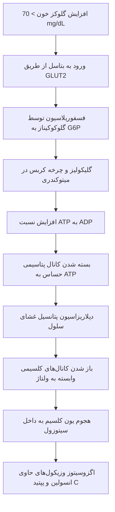

### ساختار و متابولیسم پپتیدهای جزایر لانگرهانس

- **سنتز انسولین:** رونویسی پره‌پروانسولین ⇦ هدایت به شبکه آندوپلاسمیک و جدا شدن سیگنال‌پپتید ⇦ تشکیل پروانسولین ⇦ در وزیکول گلژی **31 آمینواسید** تحت عنوان **C-peptide** جدا می‌شود.
    
- **انسولین بالغ:** دارای **51 آمینواسید** در قالب زنجیره A (حاوی 21 اسیدآمینه) و زنجیره B (حاوی 30 اسیدآمینه) متصل با پیوندهای دی‌سولفیدی.
    
- **نیمه عمر:** نیمه عمر پپتید C طولانی‌تر از انسولین است و به عنوان مارکر ترشح درون‌زاد بتاسل کاربرد دارد.
    
- **آمیلین (IAPP):** همراه انسولین ترشح شده و در دیابت نوع 2 جزء ساختاری اصلی **رسوبات آمیلوئیدی** فیبریلار است.
    

### انتقال سیگنال انسولین و مسیر Akt/PKB

1. اتصال انسولین به زیرواحد آلفای گیرنده کینازی سطح سلول.
    
2. اتوفسفوریلاسیون زیرواحد تیروزین‌کینازی بتا.
    
3. فعال شدن فاکتورهای **IRS-1** و **IRS-2**.
    
4. فعال شدن کمپلکس فسفاتیدیل اینوزیتول 3-کیناز (**PI-3K**).
    
5. فسفوریلاسیون و فعال‌سازی پروتئین کیناز B (**PKB/Akt**).
    
6. دو پیامد نهایی Akt:
    
    - انتقال وزیکول‌های حاوی ترانسپورتر **GLUT4** به غشای سلول‌های عضلانی و چربی (افزایش برداشت گلوکز).
        
    - مهار آنزیم گلیکوژن سنتتاز کیناز-3 (GSK3) و در نتیجه فعال شدن **گلیکوژن سنتتاز** (تحریک گلیکوژنز).
        

### اینکرتین‌ها و اثر اینکرتینی (Incretin Effect)

- اثر اینکرتین: ترشح انسولین در پاسخ به گلوکز خوراکی تا **4 برابر بیشتر** از انفوزیون گلوکز وریدی ایزوگلیسمیک است (مسئول بیش از 70% ترشح انسولین بعد از غذا).
    
- هورمون‌ها: **GLP-1** ترشح شده از **L-cells** روده و **GIP** از **K-cells** دئودنوم. این هورمون‌ها وابسته به سطح گلوکز (فقط در قند بالای حد ناشتا) عمل کرده، مانع ترشح گلوکاگون نیز می‌شوند.
    
- غیرفعال‌سازی سریع: توسط آنزیم **DPP-4** در عرض چند دقیقه شکسته می‌شوند.
    

## ۷. استیجینگ و ایمونوپاتوژنز دیابت نوع 1

### مراحل تکاملی دیابت نوع 1 (ADA Staging)

| **مرحله (Stage)** | **وضعیت خودایمنی (Autoimmunity)**       | **وضعیت گلیسمیک**                                  | **علائم بالینی**                                 |
| ----------------- | --------------------------------------- | -------------------------------------------------- | ------------------------------------------------ |
| **Stage 1**       | **حضور ≥ 2 اتوآنتی‌بادی** مثبت ضد جزایر | **نرموگلیسمی** (قند خون کاملاً نرمال)              | بدون علامت بالینی (Presymptomatic)               |
| **Stage 2**       | **حضور ≥ 2 اتوآنتی‌بادی** مثبت ضد جزایر | **دیس‌گلیسمی** (IFG یا IGT یا A1c بین 5.7 تا 6.4%) | بدون علامت بالینی (Presymptomatic)               |
| **Stage 3**       | مارکرهای ایمونولوژیک پایدار             | **هایپرگلیسمی تاییدشده بر اساس معیارهای دیابت**    | **بروز علائم کلاسیک** (پلی‌اوری، پلی‌دیپسی، DKA) |

> [!tip] مداخله نوین فارماکولوژیک
> آنتی‌بادی منوکلونال **تپلیزوماب (Teplizumab)** با هدف قرار دادن آنتی‌ژن **CD3** بر روی لنفوسیت‌های T، فعال‌سازی لنفوسیت‌های مخرب را مهار کرده و بروز مرحله 3 بالینی را در افراد مستقر در مرحله 2 به تعویق می‌اندازد.

### ژنتیک و سیستم HLA در دیابت نوع 1

- **هاپلوتایپ‌های با ریسک بسیار بالا:**
    
    - **DRB1\*0301 - DQB1\*0201** (DR3-DQ2)
        
    - **DRB1\*0401 - DQB1\*0302** (DR4-DQ8)
        
    - هتروزیگوت مرکب DR3/DR4 بالاترین سطح خطر ژنتیکی را داراست.
        
- **هاپلوتایپ‌های محافظت‌کننده (Protective):** **DRB1\*1501** و **DQA1\*0102 - DQB1\*0602**.
    
- **ژن‌های غیر HLA مرتبط:** _INS_ (پروموتر ژن انسولین)، _PTPN22_، _CTLA-4_ و _IL2RA_.
    
- **میزان وراثت‌پذیری بالینی:**
    
    - خطر ابتلای فرزند در صورت ابتلای مادر: 1 تا 4 درصد.
        
    - خطر ابتلای فرزند در صورت ابتلای پدر: 5 تا 9 درصد.
        
    - خطر ابتلای هم‌شیرها (خواهر/برادر): 6 تا 7 درصد.
        
    - کونکوردانس در دوقلوهای همسان تک‌تخمی: **30 تا 70 درصد**.
        

### اتوآنتی‌بادی‌های اصلی در تخریب ایمونولوژیک

1. **ICA (Islet Cell Antibodies):** آنتی‌بادی علیه اجزای سیتوپلاسمی جزایر.
    
2. **Anti-GAD (GAD65):** علیه آنزیم گلوتامیک اسید دکربوکسیلاز.
    
3. **IAA (Insulin Autoantibodies):** اتوآنتی‌بادی علیه مولکول انسولین (در کودکان کم‌سن شایع‌تر است).
    
4. **IA-2 / IA-2β:** علیه تیروزین فسفاتازهای شبه پروتئین جزایر.
    
5. **ZnT8:** علیه ترانسپورتر روی نوع 8 در غشای وزیکول‌های بتاسل. _سلول‌های اصلی اثرگذار بر تخریب بتاسل: **لنفوسیت‌های سایتوتوکسیک +CD8** به همراه سایتوکین‌های التهابی (IL-1β, TNF-α, IFN-γ) و رادیکال‌های آزاد اکسیژن._
    

## ۸. دیابت نوع 2 و فرضیه هشت‌گانه منحوس (Ominous Octet)

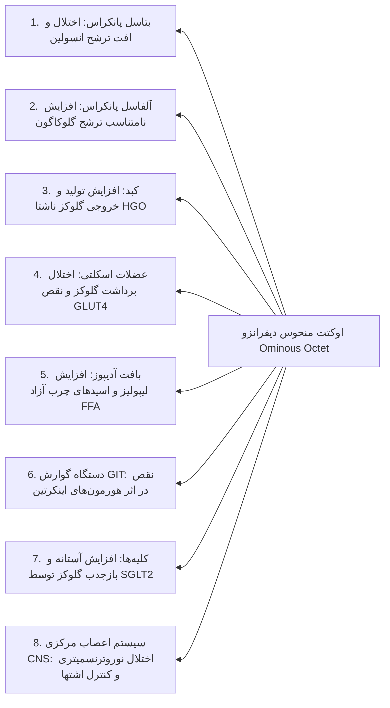

### ژنتیک و پاتوفیزیولوژی دیابت نوع 2

- ژنتیک بسیار قوی‌تر از دیابت نوع 1؛ کونکوردانس دوقلوهای تک‌تخمی بین **70 تا 90 درصد**. ابتلای هر دو والد، ریسک را به **70%** می‌رساند.
    
- ژن‌های کلیدی: **TCF7L2** (مهم‌ترین ژن شناخته‌شده با اثر بالا)، _PPARG_، _KCNJ11_، _SLC30A8_ (ZnT8)، _IRS1_ و _Calpain 10_.
    
- **پدیده مسمومیت با گلوکز (Glucose Toxicity) و لیپوتوکسیسیتی (Lipotoxicity):** اسیدهای چرب آزاد (FFA) و هایپرگلیسمی مزمن از طریق استرس اکسیداتیو، ترشح فاز اول انسولین را به شدت سرکوب و روند تخریب بتاسل را تسریع می‌کنند.
    

## ۹. عوارض حاد متابولیک: DKA در برابر HHS

### مقایسه دقیق پارامترهای آزمایشگاهی و بالینی

| **متغیر بالینی و آزمایشگاهی** | **DKA خفیف (Mild)**     | **DKA متوسط (Moderate)** | **DKA شدید (Severe)** | **HHS (حالت هایپراسمولار)**      |
| ----------------------------- | ----------------------- | ------------------------ | --------------------- | -------------------------------- |
| **قند خون پلاسمایی**          | معمولاً بالای 250 mg/dL | بالای 250 mg/dL          | بالای 250 mg/dL       | **غالباً بالای 600 (تا 1000+)**  |
| **pH شریانی**                 | 7.25 تا 7.30            | 7.00 تا 7.24             | **کمتر از 7.00**      | **بیشتر از 7.30**                |
| **بیکربنات سرم (mEq/L)**      | 15 تا 18                | 10 تا کمتر از 15         | **کمتر از 10**        | **بیشتر از 15**                  |
| **کتون ادرار و سرم**          | مثبت                    | مثبت                     | قویاً مثبت            | منفی یا اندک (Small)             |
| **اسمولاریته موثر سرم**       | متغیر (معمولاً < 320)   | متغیر                    | متغیر                 | **بیشتر از 320 mOsm/kg**         |
| **شکاف آنیونی (Anion Gap)**   | بیشتر از 10             | بیشتر از 12              | **بیشتر از 12**       | متغیر (معمولاً طبیعی)            |
| **وضعیت هوشیاری**             | کاملاً هوشیار (Alert)   | هوشیار یا خواب‌آلود      | استوپور یا کما        | **استوپور یا کمای عمیق**         |
| **کمبود آب کل بدن**           | ~ 6 لیتر (100 mL/kg)    | ~ 6 لیتر                 | ~ 6 لیتر              | **9 تا 10 لیتر (100-200 mL/kg)** |
| **مورتالیتی کلی**             | کمتر از 1%              | 1 تا 2%                  | 2 تا 5%               | **بسیار بالا (~ 15%)**           |

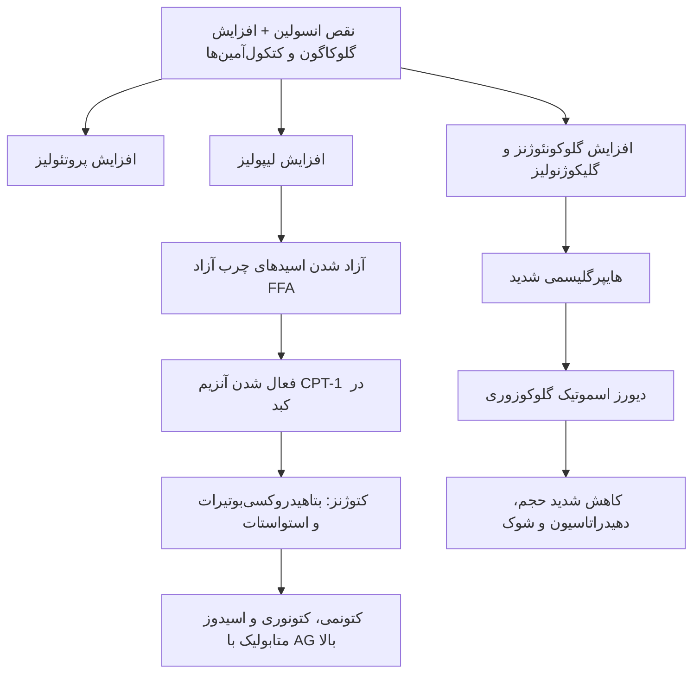

> [!important] فرمول‌های حیاتی در اورژانس‌های قند
> 
> 1. **سدیم تصحیح‌شده (Corrected Na):**  
>     
>     $$\text{Corrected Na} = \text{Measured Na} + 1.6 \times \left(\frac{\text{Plasma Glucose} - 100}{100}\right)$$
>     
>     _(به ازای هر 100 واحد افزایش قند بالای 100، باید 1.6 واحد به سدیم اضافه شود)._
>     
> 2. **اسمولاریته موثر پلاسما:**  
>     
>     $$\text{Effective Osmolality} = 2 \times [\text{Na}^+] + \frac{\text{Glucose}}{18}$$
>     
>     _(اوره به دلیل نفوذ آزاد از غشا از فرمول موثر حذف می‌شود)._
>     

## ۱۰. الگوریتم مدیریت بالینی و درمان مرحله‌به‌مرحله DKA

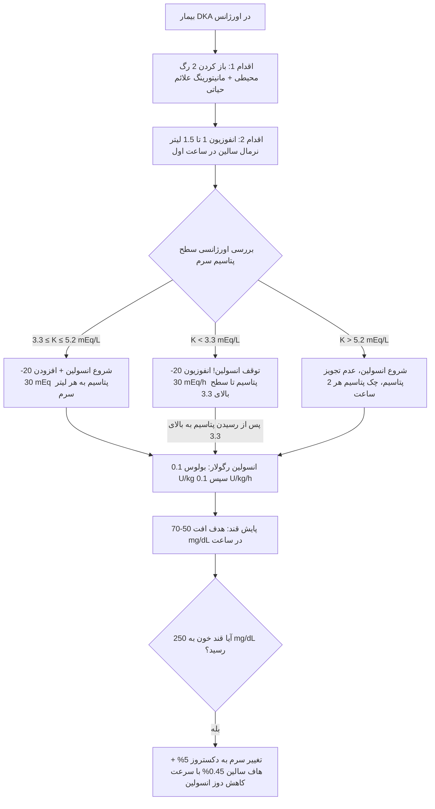

### پروتکل مایع‌درمانی و مدیریت الکترولیت‌ها

1. **مایع‌درمانی:**
    
    - **ساعت اول:** 1000 تا 1500 میلی‌لیتر سرم نرمال سالین 0.9% (10 تا 20 mL/kg/h).
        
    - **ساعات بعدی:** بررسی سدیم تصحیح‌شده؛ اگر سدیم نرمال یا بالا باشد، استفاده از **سرم هاف سالین 0.45%** (250 تا 500 mL/h). در صورت افت سدیم تصحیح‌شده، ادامه نرمال سالین 0.9%.
        
    - **رسیدن قند به 250 mg/dL:** بلافاصله سرم به **دکستروز 5% در هاف سالین** تغییر می‌یابد تا از هایپوگلیسمی و بروز ادم مغزی جلوگیری شود.
        
2. **انسولین‌درمانی:**
    
    - **ممنوعیت قطعی بولوس انسولین قبل از مایع‌درمانی:** تزریق زودهنگام انسولین پیش از مایع کافی، خطر کلاپس عروقی و شیفت مایع به سلول‌های مغز را به شدت افزایش می‌دهد.
        
    - دوز: **0.1 U/kg بولوس وریدی** به همراه **انفوزیون مداوم 0.1 U/kg/h** (یا 0.14 U/kg/h مداوم بدون بولوس). اگر قند در ساعت اول 50 تا 70 واحد افت نکرد، دوز انسولین باید **دو برابر** شود.
        
3. **پتاسیم:**
    
    - کل پتاسیم بدن در DKA به شدت دچار کمبود است (به دلایل اسیدوز، دهیدراتاسیون، دیورز اسموتیک، پروتئولیز و فقدان انسولین).
        
    - اگر **پتاسیم < 3.3 mEq/L** باشد، **تجویز انسولین مطلقاً ممنوع است** تا زمانی که با تزریق پتاسیم، سطح آن به بالای 3.3 برسد (پیشگیری از ایست قلبی و فلج عضلات تنفسی).
        
    - حفظ سطح پتاسیم سرم بین **4.0 تا 5.0 mEq/L** در طول درمان هدف اصلی است.
        
4. **بیکربنات سدیم (اندیکاسیون‌های فوق‌العاده محدود):**
    
    - تجویز روتین بیکربنات به دلیل عوارض خطرناک نظیر: **اسیدوز پارادوکسیکال مایع مغزی-نخاعی (CSF)**، هیپوکالمی شدید، تاخیر در رفع کتونمی، اختلال در آزادسازی اکسیژن بافتی و تحریک ادم مغزی در اطفال **کاملاً ممنوع است**.
        
    - **تنها اندیکاسیون:** اگر **pH شریانی کمتر از 7.0** باشد:
        
        - در **pH بین 6.9 تا 7.0:** 50 میلی‌اکی‌والان بیکربنات سدیم همراه 10 میلی‌اکی‌والان KCl در 200 میلی‌لیتر آب مقطر طی 1 ساعت.
            
        - در **pH کمتر از 6.9:** 100 میلی‌اکی‌والان بیکربنات سدیم همراه 20 میلی‌اکی‌والان KCl در 400 میلی‌لیتر آب مقطر طی 2 ساعت.
            
5. **معیارهای رفع DKA (Resolution) و گذار به انسولین زیرجلدی:**
    
    - معیارهای رفع: قند خون کمتر از 200 mg/dL همراه با حداقل دو مورد از: **بیکربنات سرم ≥ 18 mEq/L**، **pH وریدی > 7.3**، و **شکاف آنیونی طبیعی (AG ≤ 12 mEq/L)**.
        
    - **اصل هم‌پوشانی (Overlap):** تزریق اولین دوز انسولین پایه زیرجلدی (لانتوس/گلارژین یا دتمیر) باید **2 تا 4 ساعت پیش از قطع انفوزیون وریدی انسولین** انجام گیرد؛ قطع ناگهانی انسولین وریدی منجر به عود سریع کتواسیدوز می‌شود.
        

## ۱۱. عوارض مزمن دیابت: مکانیسم‌های بیوشیمیایی و پاتوفیزیولوژی

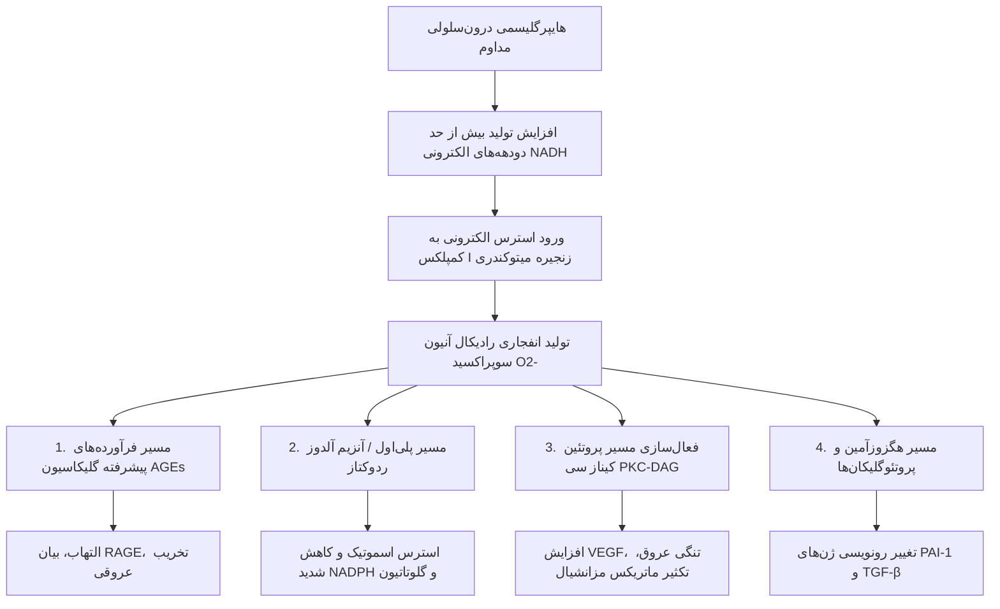

### ۵ مسیر بیوشیمیایی القای تخریب عروقی توسط گلوکز

| **مسیر پاتولوژیک**      | **آنزیم‌ها و میانجی‌های کلیدی**                        | **وقایع سلولی و مولکولی**                                                                   | **پیامد نهایی و تظاهر بالینی**                                                            |
| ----------------------- | ------------------------------------------------------ | ------------------------------------------------------------------------------------------- | ----------------------------------------------------------------------------------------- |
| **1. تشکیل AGEs**       | اتصال غیرآنزیمی گلوکز به ریشه‌های لیزین و آرژینین      | تشکیل باز شیف و محصولات آمادوری ⇦ ایجاد اتصالات متقاطع غیرقابل برگشت ⇦ اتصال به گیرنده RAGE | القای التهاب عروقی، فعال شدن NF-κB، افزایش ضخامت غشای پایه، تسریع آترواسکلروز             |
| **2. پلی‌اول (Polyol)** | آلدوز ردوکتاز (Aldose Reductase) و سوربیتول دهیدروژناز | تبدیل گلوکز به **سوربیتول** با مصرف **NADPH**، سپس تولید فروکتوز و NADH                     | استرس اسموتیک، تخلیه میواینوزیتول عصب، کاهش گلوتاتیون احیا، ایجاد آب مروارید و نوروپاتی   |
| **3. مسیر PKC**         | سنتز دو نو دی‌آسیل‌گلیسرول (DAG)                       | فعال شدن ایزوفرم‌های بتا و دلتای **پروتئین کیناز C**                                        | افزایش نفوذپذیری عروقی، افزایش ترشح **VEGF**، افزایش کلاژن و فیبرونکتین از طریق **TGF-β** |
| **4. هگزوزآمین**        | آنزیم GFAT (گلوکوزآمین-6-فسفات ترانسفراز)              | تبدیل فروکتوز-6-فسفات به UDP-GlcNAc و گلیکوزیلاسیون پروتئین‌ها                              | تغییر در فاکتورهای رونویسی، افزایش پروتئوگلیکان‌ها، فعال‌سازی ژن‌های TGF-β1 و PAI-1       |
| **5. استرس اکسیداتیو**  | کمپلکس I زنجیره انتقال الکترون                         | تولید رادیکال **سوپراکسید** به عنوان آغازگر و حلقه نهایی مشترک کلیه مسیرها                  | پراکسیداسیون لیپیدی، تخریب DNA سلولی، اختلال در سنتز نیتریک اکسید (NO)                    |

## ۱۲. عوارض میکروواسکولار دیابت (چشم، کلیه، عصب)

### الف) رتینوپاتی دیابتی (Diabetic Retinopathy)

- شایع‌ترین علت کوری غیرقابل برگشت در سنین کار (20 تا 74 سالگی).
    
- **طول مدت دیابت** مهم‌ترین ریسک‌فاکتور بروز است؛ پس از 20 سال ابتلا، تقریباً تمام بیماران نوع 1 و اکثریت بیماران نوع 2 درجاتی از رتینوپاتی را نشان می‌دهند.
    
- **فرم غیرپرولیفراتیو (NPDR):** میکروآنوریسم‌ها (اولین علامت قابل رویت)، خونریزی‌های نقطه‌ای و لکه‌ای (Blot & Dot Hemorrhages)، لکه‌های پنبه‌ای (Cotton Wool Spots ناشی از ایسکمی اعصاب)، اگزودای سخت (Hard Exudates ناشی از خروج چربی و پروتئین).
    
- **فرم پرولیفراتیو (PDR):** نشانه اختصاصی (Hallmark): **رگزایی جدید (Neovascularization)** بر روی دیسک بینایی یا ماکولا تحت تاثیر غلظت بالای **VEGF**. پیامد عروق شکننده: **خونریزی زجاجیه (Vitreous Hemorrhage)**، ایجاد بافت اسکار و کشش و در نهایت **جداشدگی شبکیه (Retinal Detachment)**.
    
- **ادم ماکولار (Macular Edema):** تورم ناشی از نشت مایع در ناحیه فووه‌آ؛ مهم‌ترین علت کاهش دید مرکزی است و **هم در فرم غیرپرولیفراتیو و هم در فرم پرولیفراتیو** می‌تواند رخ دهد.
    
- غربالگری: در دیابت نوع 1 **5 سال پس از تشخیص** و در دیابت نوع 2 **از بدو تشخیص** به صورت سالانه با معاینه فوندوسکوپی توسط چشم‌پزشک.
    

### ب) بیماری کلیوی دیابت (Diabetic Kidney Disease - DKD)

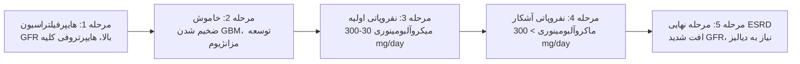

### مراحل طبیعی تکامل نفروپاتی دیابتی

| **مرحله بالینی**            | **مشخصات هیستوپاتولوژیک و تشخیصی**         | **فیلتراسیون گلومرولی (GFR)** | **دفع آلبومین ادرار**             | **وضعیت فشار خون** | **زمان‌بندی معمول** |
| --------------------------- | ------------------------------------------ | ----------------------------- | --------------------------------- | ------------------ | ------------------- |
| **مرحله 1: عملکرد مفرط**    | هایپرفیلتراسیون گلومرولی، هایپرتروفی بافتی | افزایش یافته (تا 140 mL/min)  | طبیعی یا متغیر                    | طبیعی              | در بدو تشخیص        |
| **مرحله 2: مرحله خاموش**    | افزایش ضخامت GBM، انبساط مزانژیال          | طبیعی                         | کمتر از 30 mg/day                 | طبیعی              | 5 سال اول           |
| **مرحله 3: نفروپاتی اولیه** | میکرونوئولاسیون، فیبروز مزانشیال اولیه     | شروع افت تدریجی GFR           | **میکروآلبومینوری (30-300 mg/d)** | شروع افزایش فشار   | سال 6 تا 15         |
| **مرحله 4: نفروپاتی آشکار** | ضایعات کیملستیل-ویلسون، فیبروز گلومرول     | کاهش پیشرونده GFR             | **ماکروآلبومینوری (> 300 mg/d)**  | هایپرتنشن بارز     | سال 15 تا 25        |
| **مرحله 5: نارسایی کلیه**   | اسکلروز منتشر، نارسایی اورمیک نهایی        | کمتر از 10-15 mL/min          | کاهش دفع به دلیل اسکلروز          | هایپرتنشن مقاوم    | سال 25 تا 30        |

> [!important] تمایز DKD از بیماری‌های غیردیابتی کلیه (Non-DKD)
> علائم زیر نشان‌دهنده ابتلای کلیه به عللی غیر از دیابت است و نیاز به بیوپسی کلیه دارد:
> 
> 1. حضور سدیمان ادراری فعال (**کست‌های RBC یا WBC** یا هماچوری دیس‌مورفیک).
>     
> 2. افت بسیار سریع و ناگهانی GFR.
>     
> 3. شروع سریع سندرم نفروتیک و ماکروآلبومینوری در عرض چند ماه.
>     
> 4. **فقدان رتینوپاتی دیابتی در یک فرد مبتلا به دیابت نوع 1** (در نوع 1 ارتباط رتینوپاتی و نفروپاتی تقریباً 100% است؛ عدم حضور رتینوپاتی بیماری دیگری را مطرح می‌کند).
>     

### ج) نوروپاتی دیابتی (Diabetic Neuropathy)

- **پلی‌نوروپاتی متقارن دیستال (DSPN):** شایع‌ترین فرم؛ تظاهر جوراب و دستکش (Glove & Stocking)، احساس گزگز، سوزش شبانه پاها (Burning Feet)، کرختی و کاهش حس درد و ارتعاش (Vibration).
    
- **تست‌های بالینی استاندارد:**
    
    - **مونوفیلامان 10 گرمی سمنز-واینستین (Semmes-Weinstein):** ارزیابی حس محافظتی لمس در شست پا. کسب نمره کمتر از 3.5 از 8 نشان‌دهنده ریسک بسیار بالای بروز نوروپاتی و زخم در آینده است.
        
    - **دیاپازون 128 هرتز (128-Hz Tuning Fork):** بررسی حس ارتعاش روی برجستگی استخوانی شست پا به روش On-Off.
        
- **مونونوروپاتی‌ها:** درگیری شایع عروق تغذیه‌کننده تک‌عصب (واسکولار و خودبه‌خود بهبودپذیر طی چند ماه):
    
    - **عصب جمجمه‌ای زوج 3 (اکولوموتور):** شایع‌ترین درگیری؛ تظاهر با **پتوز و دوبینی (دیپلوپی)**، در حالی که **پاسخ مردمک به نور کاملاً طبیعی و حفظ‌شده است (Pupil-sparing)**.
        
    - اعصاب جمجمه‌ای 4، 6 و 7 (Bell's Palsy).
        
    - اعصاب محیطی: عصب پرونئال (افتادگی پا: Foot Drop) و رادیال (Wrist Drop).
        
- **آمیوتروفی دیابتی (پلی‌رادیکولوپاتی):** درگیری شبکه کمری یا عصب فمورال؛ درد شدید، یک‌طرفه و حاد در ناحیه ران و کمربند لگنی همراه با تحلیل عضلات کوادریسپس و ضعف عضلانی در مردان مسن؛ ماهیت خود‌محدود‌شونده ظرف 6 تا 12 ماه.
    
- **نوروپاتی اتونوم دیابتی:**
    
    - قلبی-عروقی (CAN): تاکی‌کاردی ثابت در زمان استراحت (Resting Tachycardia)، هایپوتانسیون ارتوستاتیک شدید، طولانی شدن فاصله QTc در EKG، خطر مرگ ناگهانی قلبی (Sudden Death) و **ایسکمی بی‌صدا بدون درد قلبی (Silent MI)**.
        
    - گوارشی: گاستروپارزی (تاخیر تخلیه معده، تهوع، احساس پری و نوسانات شدید قند خون بعد غذا)، اسهال‌های شدید شبانه (Nocturnal Diarrhea) متناوب با یبوست و بی‌اختیاری مدفوع.
        
    - ادراری-تناسلی: سیستوپاتی (احتباس ادرار، مثانه نوروژنیک آتونیک، افزایش حجم باقیمانده)، انزال پس‌رونده (Retrograde Ejaculation)، اختلال نعوظ (Erectile Dysfunction) و خشکی واژن.
        
    - پوستی: **آنهیدروز (فقدان تعریق) در پاها** همراه با **هایپرهیدروز جبرانی در سر و بالاتنه**. عدم تعریق پا باعث خشکی، پوسته‌ریزی و ترک پاشنه می‌گردد.
        

## ۱۳. پای دیابتی، عفونت‌ها و تظاهرات پوستی

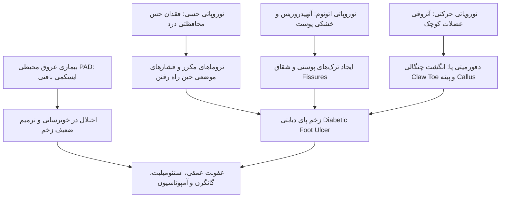

### سیستم طبقه‌بندی زخم واگنر (Wagner Classification)

- **گرید 0 (Grade 0):** بدون ضایعه باز پوستی؛ وجود دفورمیتی ساختاری پا، خشکی شدید یا سلولیت سطحی.
    
- **گرید 1 (Grade 1):** زخم سطحی با درگیری کامل ضخامت پوست، بدون آسیب به بافت‌های زیرین.
    
- **گرید 2 (Grade 2):** زخم عمقی با نفوذ به تاندون، رباط‌ها یا کپسول مفصلی، بدون تشکیل آبسه یا استئومیلیت.
    
- **گرید 3 (Grade 3):** زخم عمیق با شواهد تشکیل **آبسه عمقی**، **استئومیلیت (عفونت استخوان)** یا سپسیس مفصلی.
    
- **گرید 4 (Grade 4):** گانگرن موضعی و محدود در انگشتان، ناحیه فورفوت (Forefoot) یا پاشنه.
    
- **گرید 5 (Grade 5):** گانگرن وسیع و پیشرفته کل پا نیازمند آمپوتاسیون ماژور.
    

### عفونت‌های فرصت‌طلب و اختصاصی در بیماران دیابتی

- **موکورمایکوزیس رینوسربارال (Rhinocerebral Mucormycosis):** عفونت قارچی صاعقه‌آسا ناشی از موکور و رایزوپوس در بستر کتواسیدوز دیابتی (DKA)؛ تهاجم عروقی سریع، اسکار سیاه بر کام دهان و تخریب اوربیت و سینوس.
    
- **اوتیت خارجی بدخیم یا نکروزان (Malignant Otitis Externa):** ناشی از باکتری **سودوموناس آئروژینوزا (Pseudomonas aeruginosa)**؛ ترشحات گوش، درد خشن و پیشرفت سریع به سمت استئومیلیت قاعده جمجمه و اعصاب جمجمه‌ای.
    
- **عفونت‌های آمفیزماتوز:** پیلونفریت آمفیزماتوز و کوله‌سیستیت آمفیزماتوز ناشی از ارگانیسم‌های بی‌هوازی و تولیدکننده گاز در بافت‌های نرم مبتلا به هایپرگلیسمی.
    

### ضایعات پوستی ماژور در دیابت

- **آکانتوزیس نیگریکانس (Acanthosis Nigricans):** پلاک‌های هایپرپیگمانته مخملی در پشت گردن و چین‌های زیر بغل؛ مارکر بالینی اختصاصی **مقاومت شدید به انسولین**.
    
- **درموپاتی دیابتی (Diabetic Dermopathy / لکه‌های پوستی ساق پا):** شایع‌ترین تظاهر پوستی؛ پاپول‌های اریتماتوز کوچک در قدام تیبیا در اثر تروماهای جزئی که نهایتاً به ماکول‌های هایپرپیگمانته آتروفیک و گرد تبدیل می‌شوند.
    
- **نکروبیوزیس لیپوئیدیکا دیابتیکوروم (NLD):** ضایعه‌ای نادر که عمدتاً در **زنان جوان مبتلا به دیابت نوع 1** دیده می‌شود؛ پلاک‌های با حاشیه برجسته اریتماتوز و **مرکز آتروفیک زرد موم‌مانند با تلانژکتازی عروقی و تمایل به اولسراسیون دردناک**.
    
- **گرانولوم آنولار (Granuloma Annulare):** پلاک‌های حلقوی اریتماتوز روی تنه یا اندام‌ها.
    
- **اسکلردمای دیابتی (Scleredema Diabeticorum):** سفت و ضخیم شدن پوست گردن و پشت تنه در بیماران دیابتی با چاقی مفرط.
    

## ۱۴. داروشناسی بالینی دیابت: داروهای خوراکی و تزریقی غیرانسولینی

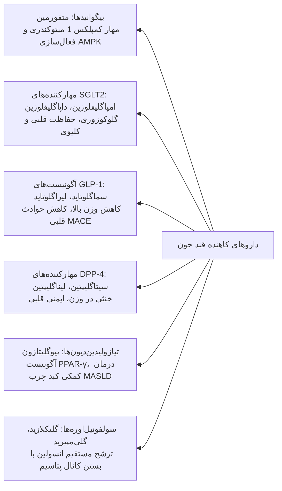

### مشخصات فارماکولوژیک جامع کلاس‌های دارویی دیابت

| **کلاس دارویی و داروها**                                 | **مکانیسم دقیق عملکرد**                                                       | **مزایای ارگانیک و اختصاصی**                                                     | **عوارض جانبی و خطرات**                                                                       | **ملاحظات دوز و نارسایی کلیوی (CKD)**                                                                    |
| -------------------------------------------------------- | ----------------------------------------------------------------------------- | -------------------------------------------------------------------------------- | --------------------------------------------------------------------------------------------- | -------------------------------------------------------------------------------------------------------- |
| **متفورمین (Metformin)**                                 | مهار کمپلکس I میتوکندری ⇦ فعال‌سازی آنزیم AMPK ⇦ سرکوب گلوکونئوژنز کبدی       | پایه درمانی، عدم ایجاد هایپوگلیسمی، خنثی یا کاهش خفیف وزن                        | **شایع‌ترین: گوارشی (اسهال، نفخ)** **خطرناک‌ترین: اسیدوز لاکتیک**                          | **منع مصرف قطعی در eGFR < 30**؛ در GFR بین 30-45 دوز نصف شود؛ قطع قبل کنتراست اگر GFR < 60               |
| **مهارکننده‌های SGLT2** _(Empagliflozin, Dapagliflozin)_ | مهار بازجذب گلوکز و سدیم در توبول پروگزیمال کلیه ⇦ گلوکوزوری و ناتریورز       | کاهش بستری نارسایی قلبی (HFrEF/HFpEF)، کاهش پیشرفت CKD، کاهش فشار                | عفونت قارچی ژنیتال (کاندیدیاز)، افت فشار و دهیدراتاسیون، **کتواسیدوز یوگلیسمیک (euDKA)**      | **آغاز درمان تا eGFR ≥ 20** و ادامه تا دیالیز؛ اثر کاهش قند در eGFR < 45 افت می‌کند                      |
| **آگونیست‌های GLP-1** _(Semaglutide, Liraglutide)_       | اتصال به گیرنده GLP-1، تحریک ترشح انسولین، سرکوب گلوکاگون، تاخیر تخلیه معده   | کاهش وزن بسیار قدرتمند، **کاهش حوادث ماژور قلبی-عروقی (MACE)**، بهبود MASLD      | تهوع و استفراغ گذرا، خطر پانکراتیت، ممنوعیت در سابقه شخصی/خانوادگی سرطان مدولاری تیروئید      | نیاز به تعدیل دوز در CKD ندارند؛ سماگلوتاید تا نارسایی پیشرفته کلیه مجاز است                             |
| **مهارکننده‌های DPP-4** _(Sitagliptin, Linagliptin)_     | مهار آنزیم تخریب‌کننده GLP-1 و GIP درون‌زاد                                   | مصرف خوراکی، تحمل عالی، وزن خنثی، **ریسک هایپوگلیسمی تقریباً صفر**               | ریسک احتمالی پانکراتیت؛ ساکساگلیپتین افزایش ریسک بستری نارسایی قلبی                           | **لیناگلیپتین بدون نیاز به تعدیل دوز در کلیه**؛ بقیه داروها متناسب با کراتینین کلیرانس کاهش دوز می‌یابند |
| **تیازولیدین‌دیون‌ها (TZD)** _(Pioglitazone)_            | فعال‌سازی گیرنده هسته‌ای **PPAR-γ** در بافت چربی و عضلات ⇦ حساس‌کننده انسولین | داروی بسیار قوی، بدون هایپوگلیسمی، **درمان موثر کبد چرب و استئاتوهپاتیت (MASH)** | **احتباس مایعات، ادم اندام‌ها، تشدید نارسایی قلبی (CHF)**، شکستگی استخوان در زنان، افزایش وزن | منع مصرف مطلق در نارسایی قلبی علامت‌دار کلاس 3 و 4 نیویورک (NYHA Class III/IV)                           |
| **سولفونیل‌اوره‌ها (SU)** _(Glimepiride, Gliclazide)_    | اتصال به زیرواحد SUR1 و بستن کانال‌های K-ATP ⇦ تحریک ترشح مداوم انسولین       | اثر کاهش قند بسیار سریع و پرقدرت، در دسترس و بسیار ارزان‌قیمت                    | **هایپوگلیسمی شدید و طولانی‌مدت**، افزایش وزن ناشی از هایپرانسولینمی                          | گلی‌بن‌کلامید به دلیل خطر هایپوگلیسمی شدید در سالمندان و نارسایی کلیه منسوخ است                          |

> [!warning] پیشگیری از کتواسیدوز
> یوگلیسمیک با مهارکننده‌های SGLT2 مهارکننده‌های SGLT2 به دلیل شیفت سوبسترای سلولی از قند به چربی می‌توانند کتواسیدوز با **قند خون کمتر از 250 mg/dL** ایجاد نمایند. توصیه‌های کلیدی انجمن AACE:
> 
> 1. قطع فوری دارو در صورت بروز علائم تهوع، استفراغ و درد شکم یا اعمال جراحی اورژانس.
>     
> 2. قطع دارو **حداقل 24 ساعت پیش از اعمال جراحی بزرگ برنامه‌ریزی‌شده** یا ورزش‌های سنگین (مانند دوی ماراتن).
>     
> 3. در این شرایط تشخیص تنها بر اساس سنجش **کتون سرمی (بتاهیدروکسی‌بوتیرات)** است و نفی کتون ادرار ارزش ردکننده ندارد!
>     

## ۱۵. الگوریتم نوین درمان دیابت نوع 2 بر اساس بیماری‌های همراه (ADA Guidelines)

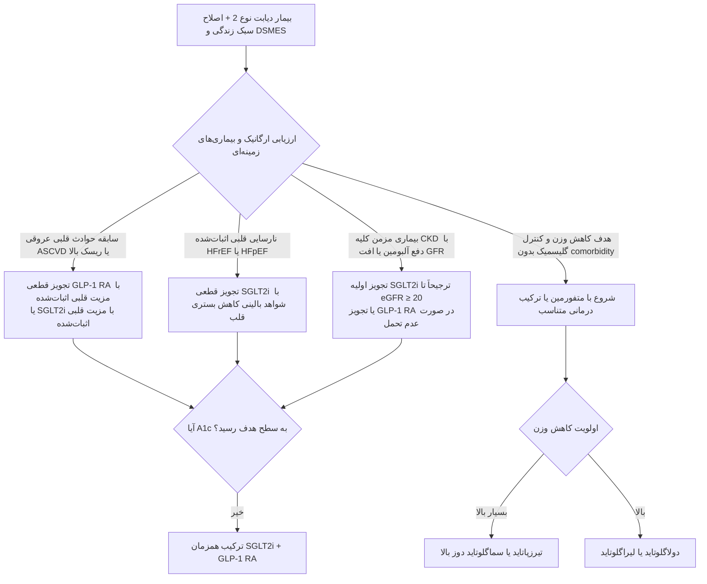

## ۱۶. انسولین‌درمانی و پروفایل فارماکوکینتیک فرآورده‌ها

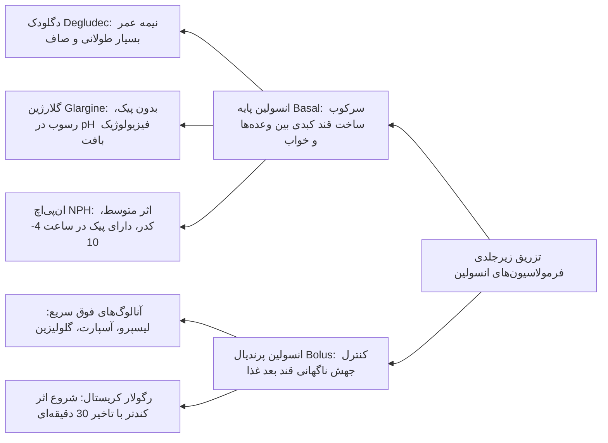

### پروفایل کامل فرآورده‌های انسولین موجود

| **نوع انسولین**          | **نام ژنریک / تجاری**         | **تغییر ساختار مولکولی**                                            | **زمان شروع اثر** | **اوج اثر (Peak)**             | **طول مدت اثر**    |
| ------------------------ | ----------------------------- | ------------------------------------------------------------------- | ----------------- | ------------------------------ | ------------------ |
| **آنالوگ سریع‌الاثر**    | لیسپرو (Lispro - Humalog)     | جابجایی دو اسیدآمینه در انتهای زنجیره B (ProB28LysB29)              | 10 تا 15 دقیقه    | **1 تا 2 ساعت**                | 3 تا 5 ساعت        |
| **آنالوگ سریع‌الاثر**    | آسپارت (Aspart - NovoRapid)   | جایگزینی پرولین با اسید آسپارتیک در موقعیت B28                      | 10 تا 15 دقیقه    | **1 تا 2 ساعت**                | 3 تا 5 ساعت        |
| **آنالوگ سریع‌الاثر**    | گلولیزین (Glulisine - Apidra) | جایگزینی آسپاراژین با لیزین و گلوتامات در B3 و B29                  | 10 تا 15 دقیقه    | **1 تا 2 ساعت**                | 3 تا 5 ساعت        |
| **کوتاه‌اثر (انسانی)**   | رگولار (Regular - کریستال)    | ساختار هگزامری طبیعی انسولین بدون تغییر ژنتیکی                      | 30 تا 60 دقیقه    | **2 تا 4 ساعت**                | 6 تا 8 ساعت        |
| **متوسط‌الاثر (انسانی)** | ان‌پی‌اچ (NPH - شیری‌رنگ)     | کمپلکس با پروتامین و سولفات روی (Isophane)                          | 1 تا 3 ساعت       | **4 تا 10 ساعت**               | 12 تا 18 ساعت      |
| **آنالوگ طولانی‌اثر**    | گلارژین (Glargine - Lantus)   | تغییر در A21 و افزودن دو آرژینین به انتهای زنجیره B (محلول در pH 4) | 1 تا 2 ساعت       | **فاقد اوج اثر (پروفایل صاف)** | **24 ساعت**        |
| **آنالوگ طولانی‌اثر**    | دتمیر (Detemir - Levemir)     | اتصال اسید چرب میریستیل به لیزین موقعیت B29                         | 1 تا 2 ساعت       | فاقد پیک واضح                  | 18 تا 24 ساعت      |
| **آنالوگ فوق طولانی**    | دگلودک (Degludec - Tresiba)   | تشکیل مولتی‌هگزامرهای طویل در بافت چربی زیرپوست                     | 1 ساعت            | **کاملاً فاقد پیک اثر**        | **بیش از 42 ساعت** |
| **انسولین هفتگی**        | آیکودک (Icodec) / افسیتورا    | آنالوگ‌های نوین پپتیدی متصل به آلبومین                              | طولانی            | فاقد پیک                       | **1 نوبت در هفته** |

> [!important] اصول محاسبه دوز در دیابت نوع 1
> 
> - دوز کل انسولین روزانه در دیابت نوع 1 پایدار: **0.4 تا 1.0 U/kg/day**.
>     
> - تقسیم دوز: **50% به عنوان انسولین پایه (Basal)** و **50% به صورت بولوس پرندیال (Bolus)** منقسم بین وعده‌های اصلی غذا.
>     

## ۱۷. ماتریس شواهد کارآزمایی‌های بالینی لندمارک دیابت

| **کارآزمایی بالینی**   | **جمعیت مورد مطالعه**                      | **اهداف مقایسه‌ای گلیسمیک**                                                              | **دستاوردها و نتایج بالینی کلیدی**                                                             | **مفاهیم اثبات‌شده و پیامدهای بلندمدت**                                               |
| ---------------------- | ------------------------------------------ | ---------------------------------------------------------------------------------------- | ---------------------------------------------------------------------------------------------- | ------------------------------------------------------------------------------------- |
| **DCCT** (1993)        | 1441 بیمار دیابت نوع 1                     | درمان فشرده (A1c هدف ~ 7.2%) در برابر درمان استاندارد (A1c ~ 9.1%)                       | کاهش 47% رتینوپاتی، کاهش 39% میکروآلبومینوری، کاهش 54% نفروپاتی، کاهش 60% نوروپاتی             | اثبات نقش علّی هایپرگلیسمی در عوارض میکروواسکولار؛ هزینه: افزایش وزن و هایپوگلیسمی    |
| **EDIC** (پیگیری DCCT) | شرکت‌کنندگان مطالعه DCCT                   | پیگیری طولی بیش از 18 تا 30 سال پس از اتمام مطالعه اصلی DCCT                             | **کاهش 57% انفارکتوس قلبی غیرکشنده، سکته و مرگ عروقی**؛ کاهش 33% مرگ کل                        | کشف پدیده **میراث درمانی (Legacy Effect)** و **حافظه متابولیک (Metabolic Memory)**    |
| **UKPDS** (1998)       | 5100 بیمار دیابت نوع 2 تازه تشخیص‌داده‌شده | درمان فشرده با سولفونیل‌اوره/انسولین یا متفورمین (A1c ~ 7.0%) در برابر رژیم غذایی (7.9%) | به ازای هر 1% کاهش A1c: **کاهش 35% عوارض میکروواسکولار**؛ کاهش دیررس حوادث کرونری و MI         | کنترل فشار خون (< 144/82) تاثیر درمانی قوی‌تری از کنترل قند بر سکته و مرگ عروقی داشت  |
| **LEADER** (2016)      | بیماران دیابت نوع 2 پرخطر قلبی             | داروی **لیراگلوتاید** در برابر پلاسبو به همراه مراقبت استاندارد                          | کاهش 13% نقاط نهایی ترکیبی ماژور قلبی-عروقی (MACE) و کاهش مرگ ناشی از CVD                      | اثبات حفاظت عروقی و سیستمیک آگونیست‌های گیرنده GLP-1                                  |
| **EMPA-REG** (2015)    | بیماران دیابت نوع 2 و بیماری قلبی قطعی     | داروی **امپاگلیفلوزین** در برابر پلاسبو به همراه مراقبت استاندارد                        | کاهش 14% در 3-point MACE، **کاهش 38% در مرگ ناشی از CVD**، کاهش 35% بستری ناشی از نارسایی قلبی | تحول بزرگ در فارماکوتراپی دیابت و معرفی مهارکننده‌های SGLT2 به عنوان محافظ قلب و کلیه |

## ۱۸. راهنمای کاربردی آموزش بیمار (DSMES)، تغذیه و مانیتورینگ

### اهداف درمانی فردی‌شده HbA1c

- **A1c < 6.5%:** افراد جوان، طول مدت کوتاه دیابت، امید به زندگی بالا، بدون سابقه بیماری قلبی عروقی، فاقد ریسک افت قند.
    
- **A1c < 7.0%:** هدف استاندارد برای اکثر بزرگسالان غیرباردار.
    
- **A1c < 8.0%:** سالمندان، سابقه حوادث قلبی مکرر، کاهش امید به زندگی، نارسایی کلیوی یا هایپوگلیسمی‌های مکرر و بدون علامت.
    

### شاخص‌های پایش مداوم قند خون (CGM)

- مانیتورینگ مداوم گلوکز مایع بین‌بافتی (ISF) هر 5 دقیقه؛ تعویض سنسور هر 14 روز.
    
- شاخص **TIR (Time In Range):** درصد زمان حضور قند خون در محدوده 70 تا 180 mg/dL؛ **هدف بالینی: بالای 70%**.
    
- شاخص **TBR (Time Below Range):** زمان قند کمتر از 70 mg/dL باید **زیر 4%** و زمان قند کمتر از 54 mg/dL باید **زیر 1%** باشد.
    

### تغذیه درمانی و فاکتورهای بالینی (MNT)

- **گلایسمیک ایندکس (GI):** سرعت و وسعت افزایش قند خون پس از مصرف 50 گرم کربوهیدرات یک ماده غذایی در مقایسه با نان سفید:
    
    - پایین: کمتر از 55
        
    - متوسط: 55 تا 70
        
    - بالا: بیشتر از 70
        
- **بار گلایسمیک (Glycemic Load - GL):** حاصلضرب GI در محتوای گرم کربوهیدرات وعده تقسیم بر 100:
    
    - پایین: کمتر از 10
        
    - متوسط: 11 تا 19
        
    - بالا: 20 و بالاتر _(مثال: هندوانه دارای GI بالای 72 است اما به دلیل آب فراوان، هر 100 گرم آن فقط 5 گرم کربوهیدرات دارد و GL آن 3.6 [بسیار پایین] است)._
        
- **توصیه‌های ورزشی:** 150 دقیقه یا بیشتر در هفته فعالیت هوازی با شدت متوسط تا شدید در 3 روز بدون وقفه بیش از 2 روز متوالی. در صورت حضور کتون در ادرار یا **قند بالای 250 mg/dL** ورزش سنگین به دلیل خطر تشدید DKA **ممنوع است**. در صورت **قند زیر 90 mg/dL** پیش از شروع ورزش مصرف کربوهیدرات الزامی است.
    

## ۱۹. مجموعه جامع دام‌های تستی و نکات امتحانی بورد و ارتقا

> [!tip] جعبه سیاه تست‌های بالینی
> 
> 1. **برخورد با هایپوگلیسمی ناشتا در کادر درمان:** بیمار گیج با قند پایین، انسولین بالا و C-peptide بالا ⇦ اولین اقدام رد سوءمصرف داروست: **اندازه‌گیری سطح سرمی سولفونیل‌اوره‌ها**. در مصرف انسولین اگزوژن، انسولین بالا ولی **C-peptide کاملاً سرکوب‌شده (< 0.1)** است.
>     
> 2. **اولویت قطعی درمان در اورژانس DKA:** تجویز **سرم نرمال سالین 0.9%** بر انسولین تقدم دارد. تزریق انسولین پیش از پر شدن حجم، بیمار را به سمت کلاپس قلبی-عروقی و مرگ سوق می‌دهد.
>     
> 3. **تنفس کوسمال (Kussmaul):** الگوی تنفسی تند و عمیق همراه با **بازدم بسیار طولانی** و بوی میوه گندیده (استون). _دام تستی: فاقد دم طولانی است!_
>     
> 4. **فلج عصب زوج 3 جمجمه‌ای در دیابت:** علامت بالینی: پتوز، انحراف چشم به خارج و پایین، دیپلوپی، اما **پاسخ مردمک به نور کاملاً طبیعی و حفظ‌شده است (Pupil sparing)**؛ برعکس ضایعات فشاری مانند آنوریسم که مردمک را متسع و فلج می‌کنند.
>     
> 5. **درمان پرفشاری خون در دیابت:** اگر فشار خون بیمار در بدو ویزیت **≥ 160/100 mmHg** باشد، درمان دارویی باید بلافاصله با **2 دارو از دو کلاس مختلف (ACEi یا ARB همراه با دیورتیک یا CCB)** آغاز گردد.
>     
> 6. **کاهش دفع آلبومین ادراری موقت:** فعالیت ورزشی شدید، بیماری تب‌دار حاد، نارسایی جبران‌نشده قلب، قاعدگی و هایپرگلیسمی بسیار شدید به صورت کاذب آلبومینوری ایجاد می‌کنند.
>     
> 7. **تست تحمل دیاپازون و مونوفیلامان:** تست دیاپازون 128 هرتز برای رد حضور نوروپاتی عالی است اما **آستانه پیش‌بینی خطر ابتلا در آینده ندارد**؛ برعکس مونوفیلامان 10 گرمی که به دقت ریسک 4 سال آینده را پیش‌بینی می‌کند.
>     
> 8. **شایع‌ترین اختلال چربی در دیابت:** **افزایش سطح تری‌گلیسرید (TG) و کاهش سطح HDL**. سطح سرمی LDL معمولاً تغییر کمی دارد اما ذرات آن متراکم، کوچک و به شدت آتروژنیک (Small dense LDL) می‌شوند.
>
